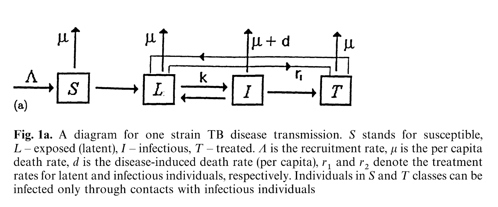

```{r setup, include=FALSE}
knitr::opts_chunk$set(echo = FALSE, include = FALSE)

# During the course, I may not have the data, so I will turn this off.
ONLINE = FALSE

# Load/install some libraries we may need
if (!require(WHO)) {
  # Download WHO package tarball from CRAN archive since it was removed
  url <- "https://cran.r-project.org/src/contrib/Archive/WHO/WHO_0.2.1.tar.gz"
  pkgFile <- "WHO_0.2.1.tar.gz"
  download.file(url = url, destfile = pkgFile)
  # Install package (no dependencies here)
  install.packages(pkgs=pkgFile, type="source", repos=NULL)
  # Delete package tarball
  unlink(pkgFile)
  # Load library
  library(WHO)
}
# if (!require(kableExtra)) {
#   # There is a problem with the current version of kableExtra, so we install a patched
#   # version from GitHub. You will need the package devtools installed for this.
#   devtools::install_github("kupietz/kableExtra")
#   library(kableExtra)
# }

# Rather than write separate code for each, go through each required package and install
# if needed
required_packages = c("wbstats", "dplyr", 
                      "deSolve", "GillespieSSA2",
                      "sensitivity", "randtoolbox",
                      "ggplot2")
for (pack in required_packages) {
  if (!require(pack, character.only = TRUE)) {
    install.packages(pack)
    library(pack, character.only = TRUE)
  }
}
```

Note: just before the pandemic, I published a paper on "being data aware" in mathematical epidemiology. You can find it [here](). I also put a copy on the GitHub repo. Note that you should really look at the code of that paper, which has its [own repository](https://github.com/julien-arino/modelling-with-data), as the publisher did a very bad job of rendering the file.

## Getting some data online

You can get some WHO data about Ethiopia from [here](https://data.who.int/countries/231), which will point you back [here](https://www.who.int/data/gho/data/themes/mortality-and-global-health-estimates/ghe-leading-causes-of-death) for leading causes of death.

Let us see, however, if we can get the data directly from R. Two libraries may prove useful: `WHO` (but this was "removed for policy violation", so who knows) and `wbstats`, which gets data from the World Bank.

```{r get_data}
if (ONLINE) {
  # WHO data sets
  WHO_data_sets <- get_codes()
  saveRDS(WHO_data_sets, "DATA/WHO_data_sets.rds")
  # World Bank data sets
  WB_data_sets <- wbstats::wb_indicators()
  saveRDS(WB_data_sets, "DATA/WB_data_sets.rds")
} else {
  WHO_data_sets <- readRDS("DATA/WHO_data_sets.rds")
  WB_data_sets <- readRDS("DATA/WB_data_sets.rds")
}
```

### WHO data sets

```{r display_WHO_data, include=TRUE}
kableExtra::kbl(WHO_data_sets$display) %>%
  kableExtra::scroll_box(height = "100px")
```

### World Bank data sets

```{r display_WB_data, include=TRUE}
kableExtra::kbl(head(WB_data_sets$indicator_desc, 20)) %>%
  kableExtra::scroll_box(height = "100px")
```

### We need to find the right data set

Those data sets are huge: there are `r nrow(WHO_data_sets)` data sets in the WHO data, and `r nrow(WB_data_sets)` in the World Bank data. We need to find the right one. Let us look for example for the word "mortality" in both data sets and see what we get.

```{r find_mortality, include=TRUE}
idx_mortablity_WHO = union(
  grep("mortality", WHO_data_sets$display, ignore.case = TRUE),
  grep("death", WHO_data_sets$display, ignore.case = TRUE))
idx_mortablity_WB = union(
  grep("mortality", WB_data_sets$indicator_desc, ignore.case = TRUE),
  grep("death", WB_data_sets$indicator_desc, ignore.case = TRUE))
```

Display the indices we found. First, from WHO

```{r display_mortality_WHO, include=TRUE}
kableExtra::kbl(WHO_data_sets$display[idx_mortablity_WHO]) %>%
  kableExtra::scroll_box(height = "100px")
```

Then World Bank

```{r display_mortality_WB, include=TRUE}
kableExtra::kbl(WB_data_sets$indicator_desc[idx_mortablity_WB]) %>%
  kableExtra::scroll_box(height = "100px")
```

You see the idea... Most of the epidemiologicalm data in WB comes from WHO and we could just skip the WB data but from the experience on 2023-12-20, we had better use that data set.

```{r}
idx_TB_WB = grep("tuberculosis", WB_data_sets$indicator_desc, ignore.case = TRUE)
```

Display the indices we found.

```{r display_TB_WHO, include=TRUE}
kableExtra::kbl(WB_data_sets[idx_TB_WB,]) %>%
  kableExtra::scroll_box(height = "100px")
```

```{r}
if (ONLINE) {
  TB_data_incidence = wb_data("SH.TBS.INCD", return_wide = FALSE) %>%
    filter(country == "Ethiopia")
  saveRDS(TB_data_incidence, "DATA/TB_data_incidence.Rds")
  TB_data_mortality = wb_data("SH.TBS.MORT", return_wide = FALSE) %>%
    filter(country == "Ethiopia")
  saveRDS(TB_data_mortality, "DATA/TB_data_mortality.Rds")
  TB_data_prevalence = wb_data("SH.TBS.PREV", return_wide = FALSE) %>%
    filter(country == "Ethiopia")
  saveRDS(TB_data_prevalence, "DATA/TB_data_prevalence.Rds")
  TB_data_cure = wb_data("SH.TBS.CURE.ZS", return_wide = FALSE) %>%
    filter(country == "Ethiopia")
  saveRDS(TB_data_cure, "DATA/TB_data_cure.Rds")
  TB_data_detection = wb_data("SH.TBS.DTEC.ZS", return_wide = FALSE) %>%
    filter(country == "Ethiopia")
  saveRDS(TB_data_detection, "DATA/TB_data_detection.Rds")
} else {
  TB_data_incidence = readRDS("DATA/TB_data_incidence.Rds")
  TB_data_mortality = readRDS("DATA/TB_data_mortality.Rds")
  TB_data_prevalence = readRDS("DATA/TB_data_prevalence.Rds")
  TB_data_cure = readRDS("DATA/TB_data_cure.Rds")
  TB_data_detection = readRDS("DATA/TB_data_detection.Rds")
}
# Now let's do a bit of data wrangling: make a table with all the data
TB_data = TB_data_incidence %>%
  select(date, incidence = value) %>%
  left_join(TB_data_mortality %>%
              select(date, mortality = value)) %>%
  left_join(TB_data_prevalence %>%
              select(date, prevalence = value)) %>%
  left_join(TB_data_cure %>%
              select(date, cure = value)) %>%
  left_join(TB_data_detection %>%
              select(date, detection = value)) %>%
  filter(date >= 2000) %>%
  arrange(date)
```

In the end, we have the following data set.

```{r display_TB_data, include=TRUE}
kableExtra::kbl(TB_data)%>%
  kableExtra::kable_styling()
```

# The model

We settled on a model, which I am modifying a bit to make it more like the one of Castillo-Chavez and Feng.



$$
\begin{aligned}
S' &= b-dS-\beta_SS\frac{I}{N} \\
L' &= \beta_SS\frac{I}{N}
+\beta_TT\frac{I}{N}
-(d+\varepsilon+t_L)L \\
I' &= \varepsilon L-(d+\delta+t_I)I \\
T' &= t_LL+t_II-\beta_TT\frac IN-dT
\end{aligned}
$$

where $S$ is the number of susceptible individuals, $L$ the number of latently infected individuals, $I$ the number of actively infected individuals and $T$ the number of treated individuals. 

First, note that $N'=(S+L+I+T)'=b-dN$ so that $N(t)=N(0)e^{-dt}$ and thus $N\to b/d$ as $t\to\infty$. From now on, we assume $N$ constant and thus when differentiating the incidence, treat it as a constant.

## Computation of $\mathcal{R}_0$

Set $L=I=T=0$ and solve for $S$, giving that at the DFE, $S^\star=b/d$.
We find that 
$$
F=\begin{pmatrix}
0 & \beta_S & 0 \\
0 & 0 & 0 \\
0 & 0 & 0 
\end{pmatrix}
$$
and 
$$
V = \begin{pmatrix}
d+\varepsilon+t_L & 0 & 0 \\
-\varepsilon & d+\delta+t_I & 0 \\
-t_L & -t_I & d
\end{pmatrix}
$$
Given the shape of $F$ and $V$, we realise that the only information we need about $V^{-1}$ is the value of the (2,1) entry, which equals
$$
\frac{\varepsilon}
{(t_I+\delta+d)(t_L+\varepsilon+d)}
$$
and thus
$$
\mathcal{R}_0 = \frac{\varepsilon\beta_S}
{(t_I+\delta+d)(t_L+\varepsilon+d)}
$$
```{r compute_R0_TB, include=TRUE}
R0_TB = function(p) {
  with(as.list(p), {
    R0 = epsilon*beta_S / 
      ((t_I+delta+d)*(t_L+epsilon+d))
    return(R0)
  })
}
```

```{r run_CTMC_ODE, include=TRUE}
RHS_TB <- function(t, x, p) {
  with(as.list(c(x,p)), {
    N = S+L+I+T
    dS <- b-d*S-beta_S*S*I/N
    dL <- beta_S*S*I/N+beta_T*T*I/N-(d+epsilon+t_L)*L
    dI <- epsilon*L-(d+delta+t_I)*I
    dT <- t_L*L+t_I*I-beta_T*T*I/N-d*T
    return(list(c(dS, dL, dI, dT)))
  })
}
reactions_TB <- list(
  # propensity function effects name for reaction
  reaction("b", c(S=+1), "birth"),
  reaction("d*S", c(S=-1), "natural_death_S"),
  reaction("d*L", c(L=-1), "natural_death_L"),
  reaction("d*I", c(I=-1), "natural_death_I"),
  reaction("d*T", c(T=-1), "natural_death_T"),
  reaction("delta*I", c(I=-1), "TB_death_I"),
  reaction("beta_S*S*I/(S+L+I+T)", c(S=-1,L=+1), "new_infection_S"),
  reaction("beta_T*T*I/(S+L+I+T)", c(T=-1,L=+1), "reinfection_T"),
  reaction("epsilon*L", c(L=-1,I=+1), "L_to_I"),
  reaction("t_L*L", c(L=-1,T=+1), "treatment_L"),
  reaction("t_I*I", c(I=-1,T=+1), "treatment_I")
)
# To make things easy, work with a total population of 100K, matching the "per 100K" 
# in the data
Pop = 100000
I_0 = TB_data$incidence[dim(TB_data)[1]]
IC <- c(S = Pop-I_0, L = I_0*10, I = I_0, T = 0)
params <- list()
if (ONLINE) {
  # Get the most recent life expectancy value from the WB data
  params$d = 1/wb_data(indicator = "SP.DYN.LE00.IN", 
                       country = "Ethiopia", mrv = 1, return_wide = FALSE)$value
} else {
  # Most recent is 64.975 years
  params$d = 0.01539053 
}
params$b = Pop*params$d
params$beta_S = 0.05
params$beta_T = 0.00002
params$delta = 1/200
params$epsilon = 1/500
params$t_L = 1/50
params$t_I = 1/20
# Final time
params$t_f = 100

set.seed(NULL)
sol_CTMC <- ssa(
  initial_state = IC,
  reactions = reactions_TB,
  params = unlist(params),
  #method = ssa_exact(),
  final_time = params$t_f,
  log_firings = TRUE    # This way we keep track of events as well
)
sol_ODE <- ode(
  y = IC,
  func = RHS_TB,
  parms = params,
  times = seq(0, params$t_f)
)
plot(sol_ODE[,"time"], sol_ODE[,"I"], type = "l")
plot(sol_CTMC$time, sol_CTMC$state[,"I"], type = "l")
```

```{r sensitivity, include=TRUE}
compute_PRCC = function(v, pars) {
  tmp = as.numeric(v)
  x = pcc(pars, tmp,
          rank = TRUE, semi = FALSE)
  return(x)
}

pars.df = data.frame(params = 
                       c("d",
                         "beta_S",
                         "beta_T",
                         "delta",
                         "epsilon",
                         "t_L",
                         "t_I"))
tmp = matrix(c( 
  1/(100*365), 1/(50*365), # d
  0.00001, 0.1, # beta_S
  0.00001, 0.1, # beta_T
  1/500, 1/100, # delta
  1/5000, 1/50, # epsilon
  1/100, 1/10, # t_L
  1/100, 1/10), # t_I)
  nc = 2, byrow = TRUE)
pars.df$min = tmp[,1]
pars.df$max = tmp[,2]

# Sensitivity sample size
N = 500

# To use sensitivity::parameterSets, we need to convert the data frame to a list
pars.list = list()
for (i in 1:dim(pars.df)[1]) {
  pars.list[[pars.df$params[i]]] = c(pars.df$min[i], pars.df$max[i])
}
nb_pars = length(pars.list)
pars.sobol = parameterSets(par.ranges = pars.list, 
                           samples = N, 
                           method = "sobol")
pars.sobol = as.data.frame(pars.sobol)
colnames(pars.sobol) = pars.df$params
# Compute R0 for each point in parameter space
R0_values = apply(pars.sobol, 1, R0_TB)
# Now compute PRCC
prcc = compute_PRCC(R0_values, pars.sobol)
# Plot the result
# plot(prcc, type = "h", 
#      xlab = "Parameter", ylab = "PRCC")
ggplot(prcc)
```
